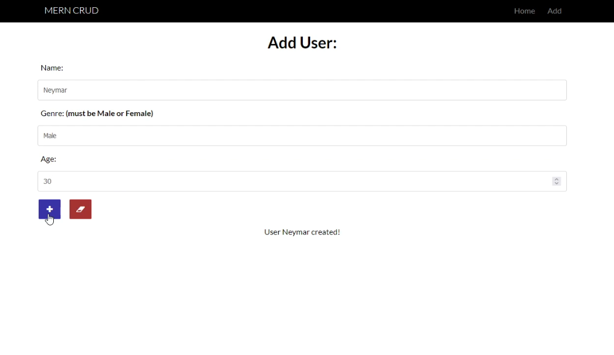
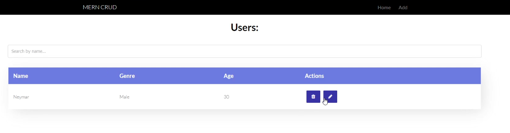
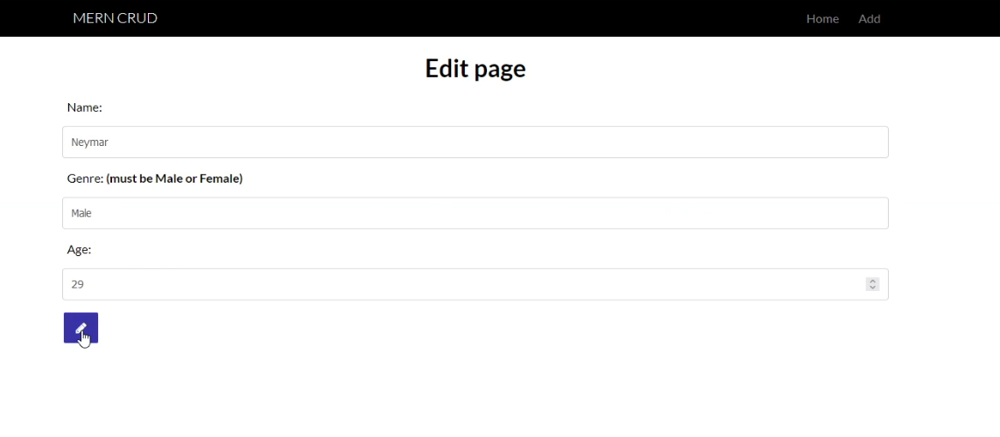

# MERN CRUD

🌟 Crud using the MERN Stack: MongoDB, Express.js, Reactjs & Node.js

## Installation

```bash
# Install dependencies for server
npm install

# Install dependencies for client
npm run client-install

# Run the client & server with concurrently
npm run dev

# Run the Express server only
npm run server

# Run the React client only
npm run client

# Server runs on http://localhost:5000 and client on http://localhost:3000
```

## How it works

# CRUD using MERN

## How it works - Frontend

[https://youtu.be/RwcSONmWl5k]

## Images

1.



2.



3. 


